# Backend Metrics: OpenTelemetry → Alloy → Prometheus → Grafana

How JVM and Tomcat metrics get out of the OpenMRS backend and onto a dashboard.

> **Status: prototype.** The metric pipeline itself is working and verified, but two
> pieces of the plumbing are deliberately temporary and are called out as such below —
> see [Temporary arrangements](#temporary-arrangements). Do not treat this document as
> the final deployment contract.

The design goal is that the backend emits **standard OpenTelemetry semantic convention
metrics over OTLP**, so an implementer can point them at any OTLP-compatible backend.
The Alloy + Prometheus + Grafana stack in this repo is one such destination, offered as
a convenience — it is not a requirement, and nothing in the backend configuration is
specific to it.

---

## The data path

```mermaid
flowchart LR
    subgraph backend["backend container"]
        JVM["Tomcat JVM<br/>(openmrs.war)"]
        AGENT["OpenTelemetry<br/>Java agent 2.30.0"]
        JVM -- "in-process +<br/>JMX MBeans" --> AGENT
    end

    subgraph alloy["alloy container"]
        RECV["otelcol.receiver.otlp<br/>:4317 gRPC · :4318 HTTP"]
        BATCH["otelcol.processor.batch"]
        EXP["otelcol.exporter.prometheus"]
        RW["prometheus.remote_write"]
        RECV --> BATCH --> EXP --> RW
    end

    PROM["Prometheus<br/>remote-write receiver"]
    GRAF["Grafana<br/>dashboards + alerts"]

    AGENT -- "OTLP/gRPC<br/>every 60s" --> RECV
    RW -- "POST /api/v1/write" --> PROM
    PROM -- "PromQL" --> GRAF
```



### 1. Collection — the OpenTelemetry Java agent

The agent is attached to the Tomcat JVM as a `-javaagent` and collects from two sources:

| Source | Produces | Driven by |
| --- | --- | --- |
| JVM runtime instrumentation | `jvm.*` (memory, GC, threads, classes, CPU) | on by default |
| JMX Insight, reading Tomcat MBeans | `tomcat.*` (requests, threads, sessions, errors) | `OTEL_JMX_TARGET_SYSTEM=tomcat` |

The agent reads JMX MBeans **in-process**. No RMI port is opened and none needs to be —
this is the main reason the agent was chosen over the alternatives (see
[Why this approach](#why-this-approach)).

Metrics are exported with **cumulative** temporality on a 60-second interval.

### 2. Transport — OTLP over gRPC

The agent ships metrics to Alloy at `http://alloy:4317` using OTLP/gRPC.

> **The protocol must be declared explicitly.** Java agent 2.x defaults
> `OTEL_EXPORTER_OTLP_PROTOCOL` to `http/protobuf`, which **cannot** talk to the gRPC
> listener on 4317 — the TCP connection is accepted and then immediately closed
> (`unexpected end of stream`). Either pairing works, but they must match:
>
> | Protocol | Port |
> | --- | --- |
> | `grpc` | `4317` |
> | `http/protobuf` | `4318` |
>
> This repo uses `grpc` + `4317`. Being explicit matters because this default has
> changed across agent versions; relying on it implicitly makes the setup fragile.

### 3. Aggregation — Grafana Alloy

Defined in [`monitoring/config.alloy`](monitoring/config.alloy):

```river
otelcol.receiver.otlp "openmrs" {
  grpc { endpoint = "0.0.0.0:4317" }
  http { endpoint = "0.0.0.0:4318" }
  output { metrics = [otelcol.processor.batch.default.input] }
}

otelcol.processor.batch "default" {
  output { metrics = [otelcol.exporter.prometheus.default.input] }
}

otelcol.exporter.prometheus "default" {
  forward_to = [prometheus.remote_write.default.receiver]
}

prometheus.remote_write "default" {
  endpoint { url = "http://prometheus:9090/api/v1/write" }
}
```

Only the `metrics` output is wired. The receiver's traces and logs outputs are
intentionally left unconnected — container logs reach Loki by a completely separate
path in the same file (`loki.source.docker` → `loki.process` → `loki.write`), which has
nothing to do with OTLP.

`otelcol.exporter.prometheus` is where OTel data model becomes Prometheus data model:
dots become underscores, units are appended to metric names, and resource attributes
are split off into `target_info` (see [Label translation](#label-translation)).

### 4. Storage — Prometheus

Prometheus **does not scrape the backend**. It receives pushed samples, which requires
the receiver to be switched on explicitly in `docker-compose.grafana.yml`:

```yaml
command:
  - --web.enable-remote-write-receiver
```

Without that flag the whole pipeline fails silently at the last hop. It is a functional
requirement, not a debugging aid.

### 5. Display — Grafana

[`monitoring/grafana/dashboards/jvm-dashboard.json`](monitoring/grafana/dashboards/jvm-dashboard.json)
(uid `openmrs-jvm`) queries these metrics through the `Prometheus` datasource. It uses
`$job` and `$instance` template variables rather than hardcoded label values, so it
works regardless of what an implementer sets `service.name` and `service.namespace` to.

---

## Configuration

All backend-side configuration is plain OTel environment variables in the `backend:`
service block of [`docker-compose.grafana.yml`](docker-compose.grafana.yml):

| Variable | Value | Purpose |
| --- | --- | --- |
| `JAVA_TOOL_OPTIONS` | `-javaagent:/openmrs/otel/opentelemetry-javaagent.jar` | attaches the agent |
| `OTEL_EXPORTER_OTLP_ENDPOINT` | `http://alloy:4317` | where to send |
| `OTEL_EXPORTER_OTLP_PROTOCOL` | `grpc` | must match the port |
| `OTEL_SERVICE_NAME` | `openmrs-backend` | becomes part of `job` |
| `OTEL_JMX_TARGET_SYSTEM` | `tomcat` | enables `tomcat.*` metrics |
| `OTEL_METRICS_EXPORTER` | `otlp` | metrics on |
| `OTEL_TRACES_EXPORTER` | `none` | **traces off — see below** |
| `OTEL_LOGS_EXPORTER` | `none` | logs go to Loki instead |
| `OTEL_RESOURCE_ATTRIBUTES` | `service.instance.id`, `service.namespace`, `deployment.environment.name` | identity labels |

### Traces are off by default, on purpose

`OTEL_TRACES_EXPORTER=none` is a policy decision, not an oversight. Traces from a
clinical system can carry patient-identifying data in span attributes and URLs.
Enabling trace export is a governance decision for the implementer to make
deliberately, with their own data-protection review — it must not become a default
that ships on.

### Two resource attributes are load-bearing

`service.instance.id` and `service.namespace` look cosmetic but are not:

- **Omitting `service.instance.id`** makes the agent generate a **random UUID per JVM
  start**, so `instance` changes on every restart and every dashboard query silently
  splits into new series.
- **Omitting `service.namespace`** changes `job` from `openmrs/openmrs-backend` to bare
  `openmrs-backend`, breaking saved queries and alert rules.

Set both explicitly, and keep them stable across restarts.

---

## Label translation

This is the part that surprises people, because `job` and `instance` exist but **do not
mean what they mean for a scraped target**. `job` is not a `scrape_config` name and
`instance` is not `host:port`. Both are synthesized by `otelcol.exporter.prometheus`:

| Prometheus label | Derived from |
| --- | --- |
| `job` | `service.namespace` + `/` + `service.name` → `openmrs/openmrs-backend` |
| `instance` | `service.instance.id` → `openmrs-backend-0` |

Metric series carry **only** `job`, `instance`, and their own metric attributes:

```promql
jvm_memory_used_bytes{
  job="openmrs/openmrs-backend",
  instance="openmrs-backend-0",
  jvm_memory_pool_name="G1 Old Gen",
  jvm_memory_type="heap"
}
```

Every **other** resource attribute is collected onto a single `target_info` series
instead of being copied onto each metric:

```promql
target_info{
  job="openmrs/openmrs-backend", instance="openmrs-backend-0",
  deployment_environment_name="dev", container_id="…", host_arch="aarch64",
  os_type="linux", process_pid="36", process_runtime_version="21.0.11+10-LTS",
  telemetry_distro_version="2.30.0", …
} 1
```

So to filter or group by environment, host, or runtime version, **join through
`target_info`** on `job` and `instance`:

```promql
jvm_memory_used_bytes
  * on(job, instance) group_left(deployment_environment_name) target_info
```

### Metric names gain unit suffixes

The Prometheus translation appends units and `_total`, so the OTel name is never quite
the name you query:

| OTel name | Prometheus name |
| --- | --- |
| `jvm.memory.used` | `jvm_memory_used_bytes` |
| `jvm.gc.duration` | `jvm_gc_duration_seconds_bucket` / `_sum` / `_count` |
| `jvm.cpu.time` | `jvm_cpu_time_seconds_total` |
| `jvm.thread.count` | `jvm_thread_count` |
| `tomcat.request.count` | `tomcat_request_count_total` |

---

## What is and isn't collected

**Collected:** `jvm.*` memory (by pool and by type), GC duration as a **histogram**,
threads (by state and daemon flag), classes, CPU utilisation and CPU time; plus
`tomcat.*` request counts and durations, thread pool usage, session counts and errors.

**Not collected — and there is no OTel equivalent, so don't go looking:**

- **Process-level metrics** — open/max file descriptors, process CPU, process start
  time, RSS. The agent does not emit these. Any `process_*` series you find in this
  stack's Prometheus belongs to **cadvisor's own Go process** (`job="cadvisor"`), not
  to the backend. Container-level equivalents are available from cadvisor.
- **JVM uptime.** No metric exists. To detect restarts, exploit the fact that
  cumulative counters reset: `resets(jvm_class_loaded_total[1h])`.
- **Database connection pool metrics.** OpenMRS uses c3p0, which registers MBeans under
  `com.mchange.v2.c3p0:type=PooledDataSource,*` — but they are not mapped, so nothing
  is exported. Mapping them onto semconv's `db.client.connection.*` namespace would
  need a custom `OTEL_JMX_CONFIG` rules file. Note that the c3p0 ObjectName contains a
  randomly generated `identityToken` that changes on every JVM start, so the pool name
  must be pinned to a constant rather than taken from the ObjectName.

### `tomcat.*` is not stable semconv

`jvm.*` metrics follow stable OpenTelemetry semantic conventions. The `tomcat.*`
metrics come from JMX Insight's `tomcat` target system and are **not** covered by
semconv stability guarantees — they can be renamed between agent versions. Bear that in
mind before building alerts on them.

---

## Pointing at your own backend

Nothing about the backend configuration is tied to Alloy. To send metrics somewhere
else, change the endpoint and drop the Alloy stack entirely:

```yaml
backend:
  environment:
    JAVA_TOOL_OPTIONS: "-javaagent:/openmrs/otel/opentelemetry-javaagent.jar"
    OTEL_EXPORTER_OTLP_ENDPOINT: https://otlp.your-vendor.example:443
    OTEL_EXPORTER_OTLP_PROTOCOL: http/protobuf
    OTEL_EXPORTER_OTLP_HEADERS: "api-key=…"
    OTEL_SERVICE_NAME: openmrs-backend
    OTEL_JMX_TARGET_SYSTEM: tomcat
    OTEL_METRICS_EXPORTER: otlp
    OTEL_TRACES_EXPORTER: none
    OTEL_LOGS_EXPORTER: none
    OTEL_RESOURCE_ATTRIBUTES: "service.instance.id=openmrs-backend-0,service.namespace=openmrs,deployment.environment.name=prod"
```

Most hosted OTLP endpoints sit behind an HTTP load balancer, so `http/protobuf` on port
`4318`/`443` is usually the right choice there — and remember the protocol and port must
agree.

---

## Operating it

### Editing monitoring config requires a rebuild

`monitoring/` is baked into a `monitoring-init` image that populates named volumes on
startup; the other containers read config from those volumes, **not** from the host.
Editing a file in `monitoring/` therefore has no effect until you rebuild:

```bash
docker compose -f docker-compose.yml -f docker-compose.grafana.yml build monitoring-init
docker compose -f docker-compose.yml -f docker-compose.grafana.yml up -d --force-recreate monitoring-init
docker compose -f docker-compose.yml -f docker-compose.grafana.yml restart grafana
```

If a change still doesn't apply, remove the relevant named volume
(`alloy-config`, `prometheus-config`, `grafana-provisioning`) and recreate. **Edits can
silently fail to take effect**, which is by far the most common cause of "my config
change did nothing".

### Prometheus does not reload its config on its own

Repopulating the `prometheus-config` volume updates the file on disk but **not** the
running process, which keeps its old config in memory. Restart the `prometheus`
container to pick up scrape-config changes.

### Changing backend env vars requires `--force-recreate`

```bash
docker compose -f docker-compose.yml -f docker-compose.grafana.yml up -d --force-recreate backend
```

---

## Verifying and troubleshooting

Work **downstream from the source**; each step isolates one hop. Steps 1–2 need
`docker exec`; steps 3–4 read Alloy's own telemetry on port `12345`.

**1. Is the agent attached and healthy?**

```bash
docker compose logs backend | grep 'otel.javaagent'
```

Look for the version banner, then for `Failed to export metrics`. Read the startup
`WARN` lines — the agent warns about a protocol/port mismatch explicitly.

**2. Is the collector reachable, on the right protocol?**

```bash
# 4318 (HTTP) should answer 200; 4317 (gRPC) closes an HTTP request → 000
docker compose exec backend curl -s -o /dev/null -w '%{http_code}\n' \
  -X POST -H 'Content-Type: application/x-protobuf' \
  --data-binary '' http://alloy:4318/v1/metrics
```

**3. Is Alloy accepting the data?** This splits backend-side faults from Alloy-side ones:

```bash
curl -s localhost:12345/metrics | grep otelcol_receiver_accepted_metric_points
```

If the metric is **absent entirely** rather than zero, the receiver has never accepted a
single request — the fault is upstream, in the backend or the network. These counters
are registered lazily on first use, so grepping for `0` finds nothing either way.

**4. Is it reaching Prometheus?**

```bash
curl -s localhost:12345/metrics | grep prometheus_remote_storage_samples_total
curl -s localhost:12345/metrics | grep prometheus_remote_storage_samples_failed_total
```

Rising `samples_total` with zero `samples_failed_total` is a healthy pipeline.

**5. Is it queryable?**

```bash
curl -s --data-urlencode 'query=jvm_memory_used_bytes' localhost:9090/api/v1/query
```

**Bypassing the network entirely.** To confirm the agent is producing correct metrics
independent of transport, set `OTEL_METRICS_EXPORTER=console` and read the backend logs.
This is a very useful test but note what it does *not* prove: it never touches the
network, so it passes even when the export path is completely broken.

> **Host ports.** Steps 3–5 assume Prometheus (`9090`) and Alloy (`12345`) are published
> to the host. Host port exposure for these two belongs in a local, uncommitted debug
> compose overlay — neither should be reachable from outside the Docker network in a
> real deployment. Anything using `--stability.level=experimental` or
> `otelcol.exporter.debug` is likewise local-only and must not be committed.

---

## Why this approach

| Option | Why not |
| --- | --- |
| **Prometheus `jmx_exporter`** | Exposes JMX-derived names of its own invention, not OTel semconv, so dashboards aren't portable between backends. |
| **Standalone OTel JMX Scraper** | Requires the JVM to expose a **JMX/RMI port**. Asking every implementer to open and secure an RMI port on a clinical system is not acceptable. |
| **OTel Java agent** ✅ | Emits stable semconv names, reads MBeans in-process with no RMI port, and speaks OTLP to any compatible backend. |

---

## Temporary arrangements

Two pieces of this setup are prototype scaffolding and are expected to change. Both are
about *how the agent gets into the container and gets attached*, not about the metric
pipeline, which is stable.

### 1. The agent jar is bind-mounted from the host

The jar currently lives at **`monitoring/otel/opentelemetry-javaagent.jar`** and is
bind-mounted into the backend:

```yaml
volumes:
  - ./monitoring/otel:/openmrs/otel:ro
```

This is a **temporary local arrangement**. It only works if the file is present on the
host, so it does not work for anyone pulling published images, and a ~24 MB binary is
not something to commit to the repository. The intended fix is to follow the pattern
the jmx_exporter already uses: download the jar at image build time in
[`monitoring/Dockerfile`](monitoring/Dockerfile), then copy it into a named volume from
[`monitoring/entrypoint.sh`](monitoring/entrypoint.sh) under a stable, unversioned
filename so the `-javaagent` path never has to track a version number.

Until then, make sure the jar is excluded from commits.

### 2. The agent is injected via `JAVA_TOOL_OPTIONS`

`JAVA_TOOL_OPTIONS` is used because the obvious alternatives don't work here:

- **`setenv.sh` cannot be used.** openmrs-core's `startup.sh` **regenerates**
  `/usr/local/tomcat/bin/setenv.sh` on every container start via a `cat > … << EOF`
  heredoc, so anything `COPY`ed to that path is clobbered before Tomcat reads it.
- **`OMRS_JAVA_SERVER_OPTS` must be avoided.** openmrs-core reads it as
  `${OMRS_JAVA_SERVER_OPTS:-<defaults>}`, so setting it **replaces** the image's default
  JVM flags rather than adding to them. Staying out of that variable means this overlay
  never has to track the backend image's JVM flags.

`JAVA_TOOL_OPTIONS` works because the JVM reads it itself and *appends* to whatever
options it was already given.

The known caveat: **every JVM started in the container inherits it**, so JDK CLI tools
also load the agent. Clear it when running them:

```bash
docker compose exec -e JAVA_TOOL_OPTIONS= backend jcmd -l
```

The eventual fix is a `startup.sh` patch in **openmrs-core** keyed off the presence of
`OTEL_EXPORTER_OTLP_ENDPOINT`, so the agent is attached properly by the entrypoint that
owns Tomcat. That is a separate change in a separate repository — this repo is a thin
layer over `openmrs/openmrs-core`, and Tomcat and the entrypoint come from there.

---

## Legacy: the Prometheus `jmx_exporter` path

The previous JVM metrics path is **still present in the tree but no longer wired up**:

- [`monitoring/Dockerfile`](monitoring/Dockerfile) still downloads
  `jmx_prometheus_javaagent`, and [`monitoring/entrypoint.sh`](monitoring/entrypoint.sh)
  still copies it plus [`monitoring/jmx_config.yml`](monitoring/jmx_config.yml) into the
  `jmx-exporter-data` volume.
- The backend no longer loads it. `JAVA_TOOL_OPTIONS` is a **single** variable and
  Compose merges `environment:` per key by **replacement**, so the OTel `-javaagent`
  value replaced the jmx one outright. Port `9404` is dead.
- The `openmrs-jvm` scrape job has been removed from
  [`monitoring/prometheus/prometheus.yml`](monitoring/prometheus/prometheus.yml).

If you see an `openmrs-jvm` target listed as **down**, that is this dead path — either a
Prometheus process still holding the pre-removal config in memory, or a stale
`prometheus-config` volume. Restart `prometheus` to clear it.

Historical samples already in the TSDB remain queryable under `job="openmrs-jvm"` for
the retention period, which is useful for comparing old and new metrics. Note that the
two use **entirely different metric and label names** — for example
`jvm_memory_used_bytes{area="heap"}` (jmx_exporter) versus
`jvm_memory_used_bytes{jvm_memory_type="heap"}` (OTel) — so queries are not
interchangeable even where a name happens to match.

Once the comparison is no longer needed, the leftovers to remove are the jmx download in
`monitoring/Dockerfile`, the copy block in `monitoring/entrypoint.sh`,
`monitoring/jmx_config.yml`, and the `jmx-exporter-data` volume.

---

## Reference

| Component | Version | Config |
| --- | --- | --- |
| OpenTelemetry Java agent | 2.30.0 | env vars in `docker-compose.grafana.yml` |
| Grafana Alloy | v1.13.1 | [`monitoring/config.alloy`](monitoring/config.alloy) |
| Prometheus | v3.9.0 | [`monitoring/prometheus/prometheus.yml`](monitoring/prometheus/prometheus.yml) |
| Grafana | 12.3 | [`monitoring/grafana/`](monitoring/grafana/) |
| Loki | 3.6 | [`monitoring/loki-config.yaml`](monitoring/loki-config.yaml) |

Start the stack, and reach Grafana at <http://localhost/grafana> (`admin` / see
`GRAFANA_ADMIN_PASSWORD` in `docker-compose.grafana.yml`):

```bash
docker compose -f docker-compose.yml -f docker-compose.grafana.yml up -d
```

See also the **Running with Grafana** section of [`README.md`](README.md).